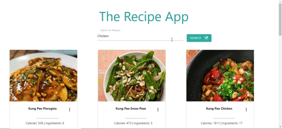

<h2>The Recipe App</h2>

This is a react app that allows users to search for recipes.

<h4>Used technologies</h4>
<ul>
  <li>HTML</li>
  <li>CSS</li>
  <li>Materialize CSS</li>
  <li>JS</li>
  <li>React</li>
</ul>

<h4>APIs</h4>
<ul>
  <li>Edamam</li>
</ul>

## Demo: 

Some notes: login feature uses bcrypt, JWT, concurrency, redux 
