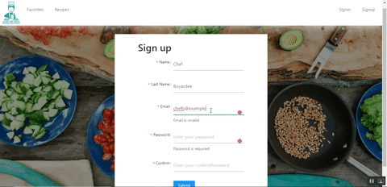

<h2>The Recipe App</h2>

This is a full stack MERN app that requires users to authenticate. Additionally, users can search for receipes and save their favorite ones.

<h4>Used technologies</h4>
<ul>
  <li>Mongo DB</li>
  <li>Express.js</li>
  <li>React</li>
  <li>Node.js</li>
  <li>Materialize CSS</li>
  <li> Ant Design </li>
</ul>

<h4>APIs</h4>
<ul>
  <li>Edamam</li>
</ul>

## Features

<h3>Register Page</h3>

In order to view recipes and save them, users must have a registered account.

<h4> Future enhancements: </h4>
<ul>
<li>User is emailed successful account creation</li>
<li>Improve form validation</li>
</ul>

<h3>Login Page</h3>

Once an account is created, the user must login.

<h4> Future enhancements: </h4>
<ul>
<li>Add the remember me feature</li>
<li>Add a way for users to retrieve forgotten passwords</li>
</ul>

<h3>Recipe Page</h3>

Once an account is created, the user can search for recipes.

<h4> Future enhancements: </h4>
<ul>
<li>Improve the search input UI</li>
</ul>

<h3>Favorites Page</h3>

If a user has sucessfully authenticated then they add recipes to their favorites list.

<h4> Future enhancements:</h4>
<ul>
<li>Allow Multiple recipes to be favorited -there is a recipe id bug</li>
<li>Improve the UI for the favorites page</li>
<li> Improve the favorite button </li>
</ul>
